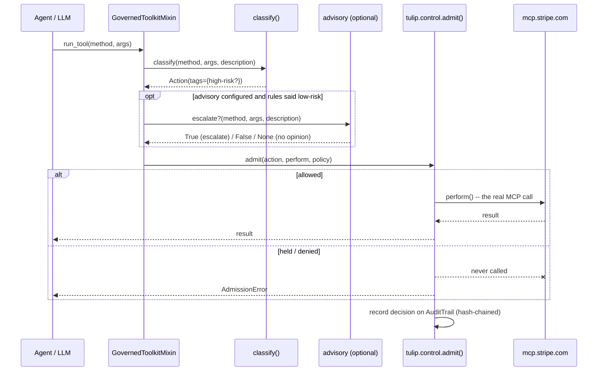

# Verification

Full history behind the code in `../../stripe_agent_toolkit/tulip/` — kept
here, not in code comments or PR comments, so both stay short.

## How a call flows



The advisory step can only turn a rules `allow` into a `hold` — never the
reverse — and any advisory failure is treated as "no opinion," falling
back to the rules verdict.

## Four real bugs, found by testing against the real thing

All four were found by connecting to the real `mcp.stripe.com` server (or,
for #3, a real model driving it) — not written as hypotheticals first.

| # | What broke | Found by | Fixed by |
|---|---|---|---|
| 1 | A refund routed through the generic `stripe_api_write` dispatcher was misclassified low-risk — the operation id, not the tool name/description, carries the real action | Live connection, reading the actual catalog shape | Match on `args["stripe_api_operation_id"]` for the write dispatcher |
| 2 | The dispatcher's own boilerplate description mentions "DELETE" (an HTTP verb), blanket-flagging every write including harmless ones | Same live connection | Stop matching dispatcher calls against their (uninformative) description |
| 3 | `stripe_api_search`'s description mentions "payout methods" as an example phrase, blanket-flagging this harmless search tool | A real frontier model (Claude Sonnet 4.5) actually driving the toolkit — it hit this path, a hand-written test wouldn't have | Informational tools (search/details/planner/feedback) always classify low-risk |
| 4 | `GetCharges` (a harmless read) matched the `charge` marker via substring in the operation id | Building the dataset below | Read dispatcher (`stripe_api_read`) always classifies low-risk — GET can't mutate |

## Dataset and results

`eval_dataset.py` is the ground truth — the real 9-tool live catalog plus
the two dispatcher regressions each bug above needed. Run it yourself:

```
python eval_dataset.py
```

```
rule-based classify() accuracy: 11/11
```

Same 11 cases (plus the harder ones with descriptions stripped, forcing a
read of the operation id alone) also run against `clusiana-admit-v4`
(tulip's own model-based classifier) in `clusiana_advisory.py`'s
underlying model, as an independent check that a model reading the real
text agrees with the rules: **11/11**, without needing any of the four
patches above — it read each operation's actual meaning instead of
pattern-matching boilerplate.

## Live, end-to-end confirmation

Real Stripe test-mode account, real `mcp.stripe.com` connection, nothing
mocked:

- Low-risk read (`get_stripe_account_info`) — executed for real, returned
  the real account id.
- High-risk write (`create_refund`) — held, never reached Stripe.
- Same call, forced-allow policy override — genuinely reached Stripe's
  real API and got a real error back (bad charge id, as expected — the
  gate's job is to let the call through, not make it succeed).
- The bug-1 bypass path (`stripe_api_write` / `PostRefunds`) — now
  correctly held.
- A harmless dispatcher write (`PostCustomers`) — correctly *not*
  blanket-flagged, real test-mode customer created.

Then re-run with a real frontier model (Claude Sonnet 4.5) actually
choosing the tool calls, and the real Clusiana advisory live and
reachable throughout — both AI surfaces exercised in the same run:

- Asked for the connected account → the model called
  `get_stripe_account_info` itself, correctly allowed.
- Asked to refund a disputed charge → the model called `stripe_api_write`
  with operation id `PostRefunds` itself, unprompted beyond the
  natural-language ask — correctly held before ever reaching Stripe.

Audit trail on every run: hash chain verified intact (`.verify() ==
True`).
